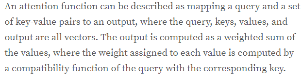

# Attention
[Michał Chromiak: attention](https://mchromiak.github.io/articles/2017/Sep/01/Primer-NN/#attention-basis)

Attention的定义：(Attention is all you need)

$$ A(q,\{(k,v)\}) \longrightarrow \sum_{i=1}^{k}f_c (q,k_i) v_i, q \in Q, k \in K, v \in V $$

输入: 任意长度的$x_1, ..., x_k$，以及查询$q$，生成权重 $\theta_1, ..., \theta_k$
输出: 输入的加权平均

$$ out = \sum_{i=1}^k \theta_i x_i $$